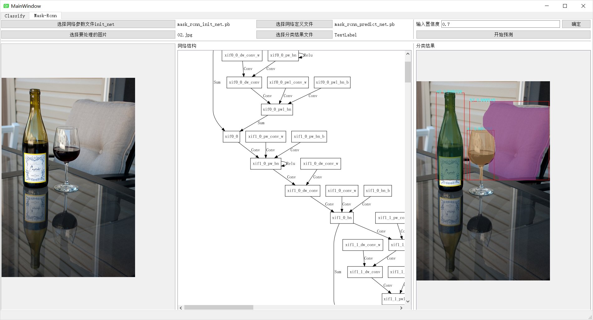

#### 可视化使用caffe2 运行squeezenet 和 mask-rcnn 进行分类和 目标检测,分割

##### 开发环境
- QT 做界面
- 在VS中下载QT插件,进行QT 开发
- caffe2
- opencv
- eigen
- openblas
- protobuf dll
- graphviz windows安装版 (用于画网络图,可执行文件dot.exe必须放在环境变量里)
- squeezenet的两个参数文件,一个分类结果文件
- mask-rcnn两个参数文件

- release 版的dll库都已编译完成,放在dlls目录下,debug版自行编译

- 想要QT程序能在别的机器上运行,cd 编译结果exe所在目录  执行windeployqt excetools.exe

- 图形界面的使用说明:
	- 分两个tab,第一个tab是squeezenet的界面,第二个是mask-rcnn的界面
	- 在开始预测前,选择好网络定义文件predict_net , 参数文件init_net ,需处理的图片,分类的结果文件
	- squeezenet必须选择分类结果文件
	- mask-rcnn没有分类结果文件
	- mask-rcnn的置信度默认为0.7,最低0.5 ,可不设
	
	- 选择网络定义文件之后,程序会load参数文件 根据网络的op生成一个dot语言写的文本文件, 调用graphviz库的dot.exe 绘制网络结构图

- 文件组织结构:
	- 每个界面都有一个.ui文件 用于编辑界面元素,一个.h文件定义界面类的数据成员和动作,一个.cpp文件实现函数
	- mainwindow.ui .h .cpp  主界面,只有一个tabWidget 用于存两个子Widget
	- classify.ui .h .cpp		squeezenet 分类的界面
	- Mask-rcnn.ui .h .cpp		mask-rcnn 目标检测和分割界面
	- caffe2.h 	包含了必要的头文件

### 使用mask-rcnn网络进行预测

- 相比于squeezenet 这种分类的卷积网络,mask-rcnn的计算过程和输出形式要复杂一些,网络内也使用了一些特有的operator.

#### mask-rcnn的功能

- 目标检测:输出检测的目标所在的区域和置信度
- 目标分类:输出目标所在的类别
- 目标分割:输出目标的mask,对mask插值恢复至目标大小,并与原图结合得到分割的结果

#### mask-rcnn 参数文件的获取和说明

- [cafffe2官网提供的model zoo](https://github.com/caffe2/models/tree/master/mask_rcnn_2go)
- 官网提供的mask-rcnn参数文件中并没有提供分类后的文件,所以并不知道该mask-rcnn能处理哪些类别的物体
- 已知的是该mask-rcnn能分类81种物体
- 经测试,该mask-rcnn分割的精度和通用性有限
- 官网提供了处理浮点输入的参数文件和处理int8输入的参数文件,我使用了浮点输入的参数文件,需要将输入的矩阵转化成float类型
- 输入图像的规格:((1,3,H,W) min(H,W)>=320

#### 查看mask-rcnn网络使用的operator

- 官网提供了二进制网络定义文件 model.pb和网络参数文件model_init.pb ,同时提供了文本形式的网络定义文件 mode.pbtxt
- 可以使用protobuf读取proto文件,实现二进制和文本文件的转换(需要include caffe2 定义Netdef的源文件)
  - **caffe2提供的接口**
    - 读取二进制参数文件可使用ReadProtoFromBinaryFile(string,NetDef*)
    - 读取文本参数文件使用ReadProtoFromTextFile(string,NetDef*)
  - **protobuf 提供的原始读取参数接口 :**
    - 使用bool message.ParseFromIstream(istream* input)读取参数文件
    - 使用bool SerializeToOstream(ostream* output)const 写入文件流
- mask-rcnn的网络结构有个特点,operator中有个If 分支,在分支里创建了一个子网络,通过观察文本形式的网络定义文件可发现:子网络的定义和主网络的定义缩进不在同一级
- 有的operator在子网络中第一次出现,因此,统计mask-rcnn使用的operator时不能忽略这部分operator

##### 写程序输出mask-rcnn所用到的opoerator

- 使用protobuf装载网络定义文件
- 对 Netdef 对象中的op 遍历
- 如果op是If 那么递归的调用该程序
- 否则将该op的名字加入到set中
- 将set中的operator名字输出到文件中,就得到了mask-rcnn用到的所有operator,可以在输出时稍作修饰,直接输出在命令行中    搜索包含该字符串的文件  的指令
- findstr /S "operator" \*.\*
- 依次查看目标operator是否已在项目中,如果没有,从完整的caffe2包中搜索,添加到项目目录

#### caffe2 输入输出的数据结构

###### caffe2::Predictor::TensorVector

- 这是向caffe2::Predictor 输入的类型
- using TensorVector = std::vector<TensorCPU\*>  是类型为TensorCPU\*的vector
- typedef Tensor<CPUContext>TensorCPU   TensorCPU是Tensor的一个实例
- Tensor的数据成员: 
  - vector<int64_t\>dims_
  - int64_t size
  - std::shared_ptr<void>data
- TensorVector作为输入时,只需要一个TensorCPU作为vector<TensorCPU*>唯一的元素
  - 使用Resize(1,3,height,width) 确定输入的格式
  - 使用ShareExternalPointer(T *data)绑定输入数据的指针 例:vector<float>vec;vec.data()可作为其参数
- TensorVector 作为输出时 outVec的每一个Tensor都保存了一个方面的信息,具体的,mask-rcnn中:
  - outVec[0] 包含各个分类的置信度,置信度过低的去除
  - outVec[1] 对应的是各个分类的索引
  - outVec[2] 输出目标所在矩阵的左上和右下坐标,有的结果非法(宽度过低,起点在图像之外),应去除
  - outVec[3] 输出 各类的掩码 x\*81\*12\*12
    - 分割出x个物品,输出了81个掩码(取平均计算),每个掩码12*12像素

#### 处理mask-rcnn的输出

- Tensor 中data的访问方法:

  - tensor->data<Type>()[pos]     (data返回的是指针)

- Tensor中dims的访问方法(对vector的访问方法):

  - tensor->dims().size()
  - tensor->dims().at(pos) or[pos]

- 目标检测

  - 对于每一个输出目标,如果置信度小于阈值 忽略该结果
  - 获取outVec[2] 中记录的目标坐标,剔除明显非法的情况
  - 在原图中使用cv::putText() 在原图添加描述信息

- 分割

  - 将原图转换为4维,a通道为透明度

    - cv::cvtColor(img,img,COLOR_BGR2BGRA)

  - 对于outVec[3]中每个物体的81个掩码,求平均值

  - 使用双线性插值将mask  resize成为roi的大小

    - opencv提供了插值的接口 
      cv::resize(img,largeImg,cv::Size(wid,hei),0,0,cv::INTER_LINEAR)

  - 取原图的roi区域

  - 逐像素处理,将mask中val>0.5的像素以0.6的权值并到roi区域

    ```
    cv::Vec4b &roiD = roi.at<cv::Vec4b>(x, y);
    roiD = roiD * 0.4 + cv::Vec4b( (i+25)*267%255, (i+34) * 107 % 255, (i+10) * 53 % 255, 255)*0.6;
    ```

#### 结果

